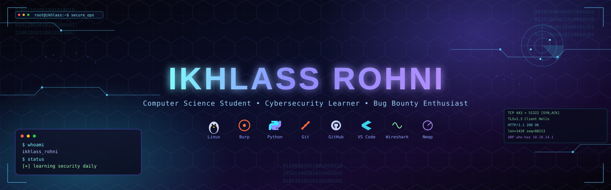

<div align="center">

<!-- 🔽 Upload banner.svg to your repo (e.g. assets/banner.svg) and point this src at it -->


<br/>

<a href="#">
  
</a>

<br/><br/>


&nbsp;

&nbsp;


<br/><br/>

<a href="https://github.com/ikhlassrohni"></a>
<a href="#"></a>
<a href="#"></a>
<a href="#"></a>

</div>

<br/>


## 🧠 About Me

```bash
ikhlass@security:~$ cat about.txt
```

```yaml
Name:        Ikhlass Rohni
Role:        Computer Science Student @ ENSTA
Focus:       Cybersecurity, Web Security, Bug Bounty, Digital Forensics
Also into:   Linux, Networking, Python, C Programming
Mission:     Becoming an Elite Security Engineer — one CTF, one write-up,
             and one real-world project at a time.
```

```bash
ikhlass@security:~$ cat currently_learning.txt
```

- 🕸️ PortSwigger Web Security Academy
- 🏁 PicoCTF challenges
- 🐧 Linux Administration
- 🐍 Python Security Tooling
- 🔧 Git & GitHub workflows
- 🔍 Digital Forensics fundamentals

> I'm not chasing shortcuts — I'm building the fundamentals that elite security engineers are made of.


## ⚙️ Skills

<div align="center">

### Programming Languages


### Operating Systems


### Development Tools


</div>

<br/>

### 🛡️ Cybersecurity Arsenal

<div align="center">

| Category | Tools |
|---|---|
| **Web Security** | Burp Suite, ffuf, Feroxbuster, Gobuster, Dirsearch |
| **Network Analysis** | Nmap, Wireshark, tcpdump, Netcat, Proxychains |
| **Password Auditing** | Hydra, Hashcat, John the Ripper |
| **Data Analysis** | CyberChef |
| **Environments** | Kali Linux, Ubuntu |

</div>

<div align="center">


</div>


## 📈 Learning Roadmap

```
Web Security (PortSwigger)   ████████░░░░░░░░░░░░  In Progress
Linux Administration         ██████████░░░░░░░░░░  In Progress
Python for Security          ███████░░░░░░░░░░░░░  In Progress
Networking Fundamentals      ████████░░░░░░░░░░░░  In Progress
Digital Forensics            █████░░░░░░░░░░░░░░░  In Progress
CTF Practice (PicoCTF)       ██████░░░░░░░░░░░░░░  Ongoing
```

> Progress bars reflect an active, ongoing learning path — not final scores.


### 🐧 Linux Notes
A structured personal knowledge base documenting Linux administration, hardening, and command-line workflows.

`Linux` `Documentation`

</td>
</tr>
<tr>
<td width="50%">

### 🐛 Bug Bounty Writeups
Write-ups documenting methodology, findings, and lessons learned while practicing web application security testing.

`Web Security` `Writeups`

</td>
<td width="50%">

### 🏁 PicoCTF Solutions
Documented solutions and approaches to PicoCTF challenges across categories like web, crypto, and forensics.

`CTF` `Problem Solving`

</td>
</tr>
</table>

</div>

> 📌 Pin these repositories on your GitHub profile so they render as live, clickable cards above this section.


## 🎯 Goals

- [x] Set up a structured cybersecurity learning path
- [x] Start PortSwigger Web Security Academy
- [x] Begin solving PicoCTF challenges
- [ ] Complete Web Security Academy core learning paths
- [ ] Publish first public bug bounty writeup
- [ ] Build and document a digital forensics project
- [ ] Contribute to an open-source security tool
- [ ] Participate in a live CTF competition


## 💻 Terminal

```bash
ikhlass@security:~$ whoami
ikhlass_rohni

ikhlass@security:~$ pwd
/home/ikhlass/cybersecurity-journey

ikhlass@security:~$ ls
about.txt   currently_learning.txt   projects/   mission.txt   roadmap.log

ikhlass@security:~$ cat mission.txt
Become an Elite Security Engineer while continuously
building real-world projects and learning through practice.
```


<div align="center">

### 🔐 "Security is not a product, but a process."
*— Bruce Schneier*

<br/>


</div>
